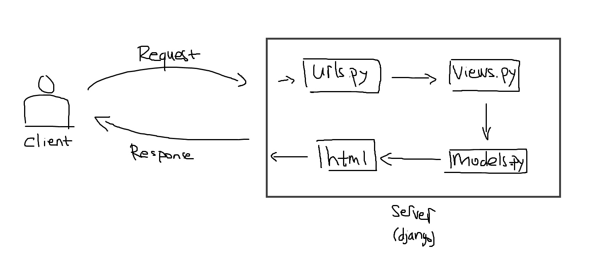

1.  Jelaskan bagaimana cara kamu mengimplementasikan checklist di atas secara step-by-step (bukan hanya sekadar mengikuti tutorial).

    -   Pastikan sudah terinstall python dalam device
    -   Buat virtual environment menggunakan venv dengan nama bebas
    -   Jalankan virtual environment
    -   Siapkan dependencies, bisa dengan menulis apa saja dependencies yang dibutuhkan di file requirements.txt lalu menginstall nya. Atau bisa dengan menginstall satu persatu dependencies lalu baru simpan dependencies yang sudah di install ke file requirements.txt
    -   Jalankan `django-admin startproject ja_warehouse .` untuk membuat proyek
    -   Tambahkan \* pada ALLOWED_HOSTS di settings.py untuk keperluan deployment
    -   Setting .gitignore
    -   Membuat aplikasi main dengan menjalankan `python manage.py startapp main`
    -   Tambahkan aplikasi main pada INSTALLED_APPS
    -   Membuat folder templates pada aplikasi main, lalu buat main.html dengan isi yang menampilkan nama aplikasi serta nama dan kelas
    -   Buat model Item pada file models.py dengan attribut name (charfield), amount (integer), description (text field), price (integer), dan category (charfield)
    -   Melakukan pembuatan file migrasi dan menerapkan file migrasi tersebut
    -   Menghubungkan view dan template dengan membuat fungsi pada view untuk merender main.html yang tadi sudah dibuat
    -   Mengonfigurasi routing dengan membuat file urls.py di aplikasi main lalu menambahkan path '' atau home yang akan menjalankan fungsi pada view yang tadi sudah dibuat
    -   Setelah itu menambahkan routing pada url proyek dengan menambahkan path '' atau home yang akan menjalankan/impor (include) rute aplikasi main
    -   Aplikasi sudah dibisa dijalankan dengan `python manage.py runserver`
    -   Mendeploy pada adaptable dengan cara:
        -   Login dengan akun github
        -   Membuat/menambahkan aplikasi baru (klik new app) dengan menyambungkan repo yang sudah dibuat (ja-warehouse)
        -   Pilih branch main (branch production)
        -   Pilih template dengan python dan database postgreSQL
        -   mengubah python version dengan versi yg ada di device saya (3.10) dan ubah start command dengan `python manage.py migrate && gunicorn shopping_list.wsgi`
        -   memilih nama dengan nama ja-warehouse
        -   checklist HTTP Listener on PORT
        -   lalu deploy app

2.  Buatlah bagan yang berisi request client ke web aplikasi berbasis Django beserta responnya dan jelaskan pada bagan tersebut kaitan antara urls.py, views.py, models.py, dan berkas html.

    

    -   Pertama client akan melakukan request ke aplikasi (server)
    -   Pada urls.py tersebut lah request client akan diterima diarahkan ke view yang tepat
    -   Setelah diarahkan ke view yang tepat, views.py akan menjalankan logika yang mengelola request sehingga bisa menghasilkan response
    -   models.py berisi definisi model database. File ini digunakan untuk berinteraksi dengan database dan logika bisnis
    -   File HTML akan berisi struktur dan tampilan halaman web yang akan diberikan kepada client
    -   Sehingga views.py dapat memanggil models.py untuk berinteraksi dengan database, lalu data yang didapat bisa dirender melalui file HTML
    -   Response adalah respon akhir yang dikirim dari aplikasi ke client

3.  Jelaskan mengapa kita menggunakan virtual environment? Apakah kita tetap dapat membuat aplikasi web berbasis Django tanpa menggunakan virtual environment?

    Penggunaan virtual environment merupakan best practice dalam pengembangan aplikasi Django, karena dengan menggunakan virtual environment kita dapat mengelola dependensi dan paket Python secara terpisah untuk setiap proyek, sehingga dapat mencegah konflik antara versi paket yang berbeda antar proyek. Dengan virtual environment kita juga dapat memilih versi python yang sesuai. Dan penggunaan virtual environment ini membuat instalasi dependensi terpisah dari instalasi python pada sistem operasi (global).

    Secara teknis kita masih dapat membuat aplikasi Django tanpa menggunakan virtual environment, tetapi hal ini tidak dianjurkan karena terdapat risiko dan kendala yang mungkin terjadi. Kendalanya dapat berupa konflik antar proyek yang menggunakan versi python yang berbeda. Selain itu, terdapat risiko pencampuran dependensi di seluruh sistem yang dapat menyebabkan masalah yang sulit diidentifikasi dan diperbaiki.

4.  Jelaskan apakah itu MVC, MVT, MVVM dan perbedaan dari ketiganya.

    -   MVC (Model View Controller)

        -   Model: berinteraksi dengan database dan logika bisnis aplikasi
        -   View: menampilkan data kepada pengguna
        -   Controller: berfungsi untuk mengatur alur aplikasi dan sebagai perantara antara model dan view

    -   MVT (Model View Template)

        -   Model: berinteraksi dengan database dan logika bisnis aplikasi
        -   View: menampilkan data kepada pengguna, namun juga berisi logika untuk penampilan data kepada pengguna
        -   Template: memproses tampilan yang berisi kode HTML yang digunakan untuk merender data

    -   MVVM (Model View ViewModel)

        -   Model: berinteraksi dengan database dan logika bisnis aplikasi
        -   View: menampilkan data kepada pengguna
        -   ViewModel: mengonversi data dari model ke format yang lebih sesuai untuk tampilan di view

    Perbedaannya utamanya adalah:

    -   MVC : Terdapat controller sebagai pengelola alur aplikasi dan perantara antara model dan view
    -   MVT : Terdapat template sebagai komponen untuk merender tampilan, dan view memiliki logika lebih untuk penampilan data
    -   MVVM : Terdapat ViewModel sebagai perantara yang mengonversi data dari model ke format yang lebih sesuai untuk tampilan
