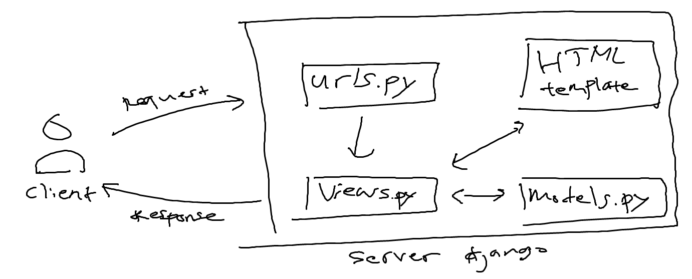
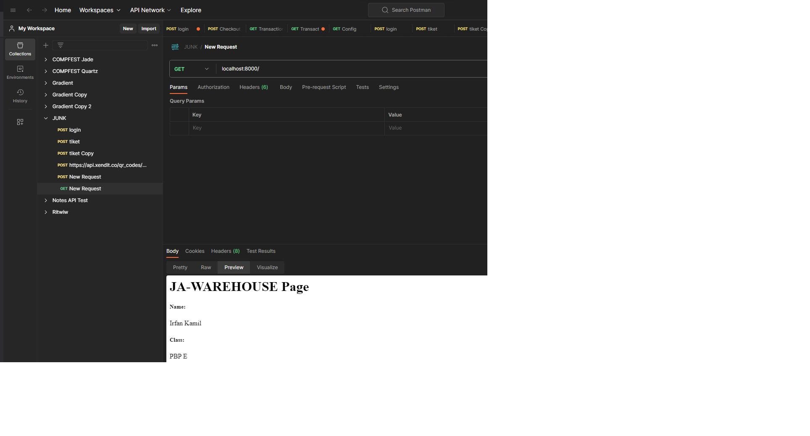
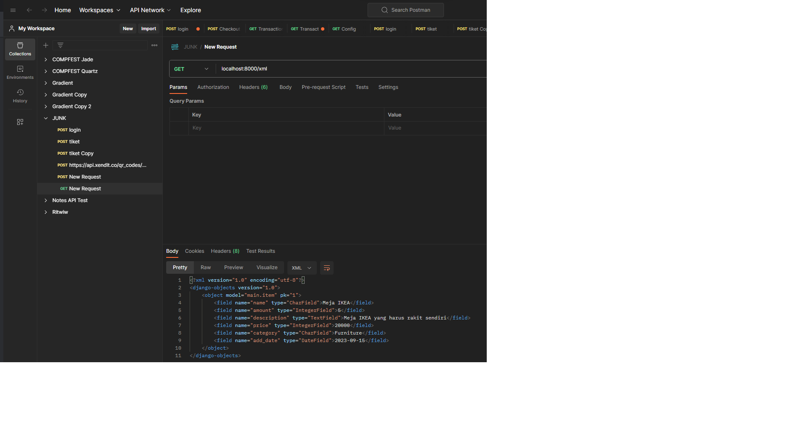
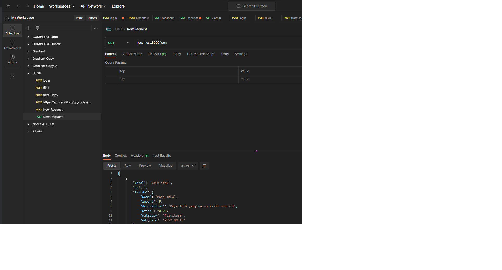
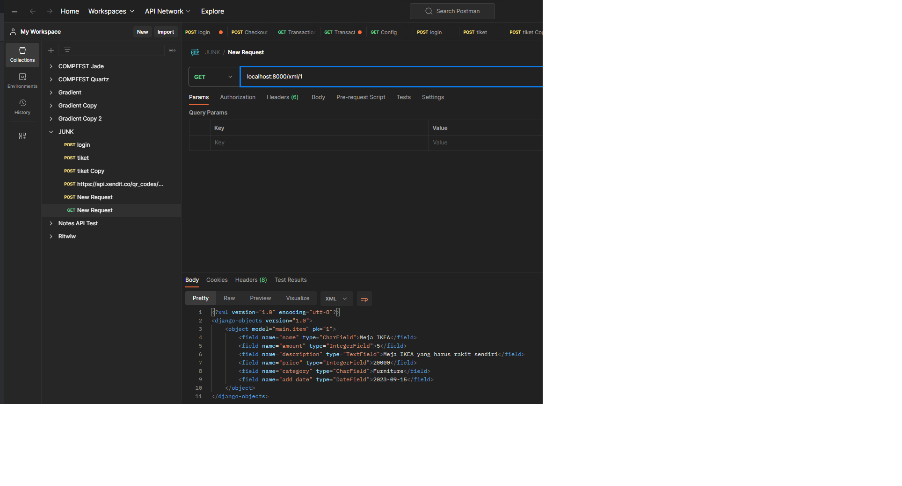
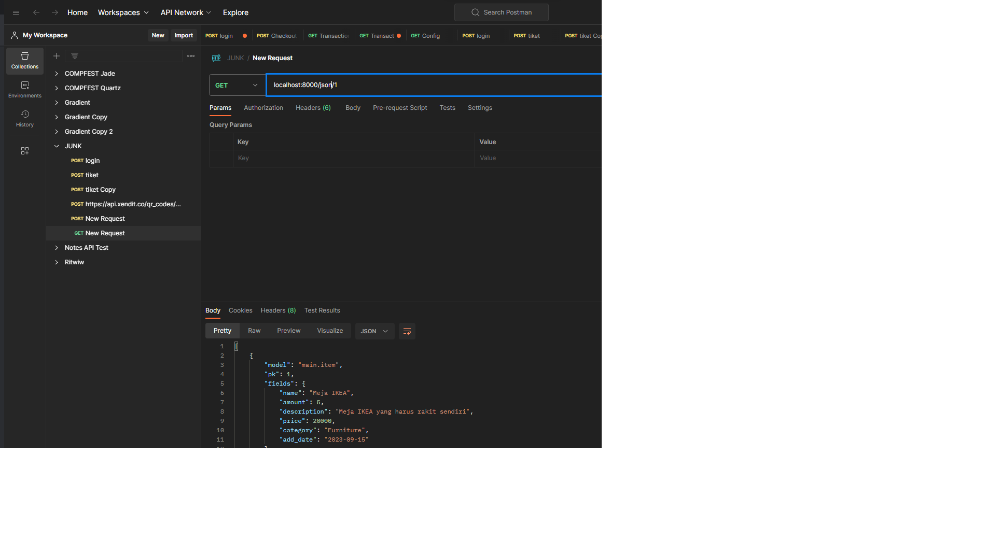

# TUGAS 2

1.  Jelaskan bagaimana cara kamu mengimplementasikan checklist di atas secara step-by-step (bukan hanya sekadar mengikuti tutorial).

    -   Pastikan sudah terinstall python dalam device
    -   Buat virtual environment menggunakan venv dengan nama bebas
    -   Jalankan virtual environment
    -   Siapkan dependencies, bisa dengan menulis apa saja dependencies yang dibutuhkan di file requirements.txt lalu menginstall nya. Atau bisa dengan menginstall satu persatu dependencies lalu baru simpan dependencies yang sudah di install ke file requirements.txt
    -   Jalankan `django-admin startproject ja_warehouse .` untuk membuat proyek
    -   Tambahkan \* pada ALLOWED_HOSTS di settings.py untuk keperluan deployment
    -   Setting .gitignore
    -   Membuat aplikasi main dengan menjalankan `python manage.py startapp main`
    -   Tambahkan aplikasi main pada INSTALLED_APPS
    -   Membuat folder templates pada aplikasi main, lalu buat main.html dengan isi yang menampilkan nama aplikasi serta nama dan kelas
    -   Buat model Item pada file models.py dengan attribut name (charfield), amount (integer), description (text field), price (integer), dan category (charfield)
    -   Melakukan pembuatan file migrasi dan menerapkan file migrasi tersebut
    -   Menghubungkan view dan template dengan membuat fungsi pada view untuk merender main.html yang tadi sudah dibuat
    -   Mengonfigurasi routing dengan membuat file urls.py di aplikasi main lalu menambahkan path '/main' yang akan menjalankan fungsi pada view yang tadi sudah dibuat
    -   Setelah itu menambahkan routing pada url proyek dengan menambahkan path '/main' yang akan menjalankan/impor (include) rute aplikasi main
    -   Aplikasi sudah dibisa dijalankan dengan `python manage.py runserver`
    -   Mendeploy pada adaptable dengan cara:
        -   Login dengan akun github
        -   Membuat/menambahkan aplikasi baru (klik new app) dengan menyambungkan repo yang sudah dibuat (ja-warehouse)
        -   Pilih branch main (branch production)
        -   Pilih template dengan python dan database postgreSQL
        -   mengubah python version dengan versi yg ada di device saya (3.10) dan ubah start command dengan `python manage.py migrate && gunicorn ja_warehouse.wsgi`
        -   memilih nama dengan nama ja-warehouse
        -   checklist HTTP Listener on PORT
        -   lalu deploy app

2.  Buatlah bagan yang berisi request client ke web aplikasi berbasis Django beserta responnya dan jelaskan pada bagan tersebut kaitan antara urls.py, views.py, models.py, dan berkas html.

    

    -   Pertama client akan melakukan request ke aplikasi (server)
    -   Pada urls.py tersebut lah request client akan diterima diarahkan ke view yang tepat
    -   Setelah diarahkan ke view yang tepat, views.py akan menjalankan logika yang mengelola request sehingga bisa menghasilkan response
    -   models.py berisi definisi model database. File ini digunakan untuk berinteraksi dengan database dan logika bisnis
    -   File HTML akan berisi struktur dan tampilan halaman web yang akan diberikan kepada client
    -   Sehingga views.py dapat memanggil models.py untuk berinteraksi dengan database, lalu data yang didapat bisa dirender melalui file HTML
    -   Response adalah respon akhir yang dikirim dari aplikasi ke client

3.  Jelaskan mengapa kita menggunakan virtual environment? Apakah kita tetap dapat membuat aplikasi web berbasis Django tanpa menggunakan virtual environment?

    Penggunaan virtual environment merupakan best practice dalam pengembangan aplikasi Django, karena dengan menggunakan virtual environment kita dapat mengelola dependensi dan paket Python secara terpisah untuk setiap proyek, sehingga dapat mencegah konflik antara versi paket yang berbeda antar proyek. Dengan virtual environment kita juga dapat memilih versi python yang sesuai. Dan penggunaan virtual environment ini membuat instalasi dependensi terpisah dari instalasi python pada sistem operasi (global).

    Secara teknis kita masih dapat membuat aplikasi Django tanpa menggunakan virtual environment, tetapi hal ini tidak dianjurkan karena terdapat risiko dan kendala yang mungkin terjadi. Kendalanya dapat berupa konflik antar proyek yang menggunakan versi python yang berbeda. Selain itu, terdapat risiko pencampuran dependensi di seluruh sistem yang dapat menyebabkan masalah yang sulit diidentifikasi dan diperbaiki.

4.  Jelaskan apakah itu MVC, MVT, MVVM dan perbedaan dari ketiganya.

    -   MVC (Model View Controller)

        -   Model: berinteraksi dengan database dan logika bisnis aplikasi
        -   View: menampilkan data kepada pengguna
        -   Controller: berfungsi untuk mengatur alur aplikasi dan sebagai perantara antara model dan view

    -   MVT (Model View Template)

        -   Model: berinteraksi dengan database dan logika bisnis aplikasi
        -   View: menampilkan data kepada pengguna, namun juga berisi logika untuk penampilan data kepada pengguna
        -   Template: memproses tampilan yang berisi kode HTML yang digunakan untuk merender data

    -   MVVM (Model View ViewModel)

        -   Model: berinteraksi dengan database dan logika bisnis aplikasi
        -   View: menampilkan data kepada pengguna
        -   ViewModel: mengonversi data dari model ke format yang lebih sesuai untuk tampilan di view

    Perbedaannya utamanya adalah:

    -   MVC : Terdapat controller sebagai pengelola alur aplikasi dan perantara antara model dan view
    -   MVT : Terdapat template sebagai komponen untuk merender tampilan, dan view memiliki logika lebih untuk penampilan data
    -   MVVM : Terdapat ViewModel sebagai perantara yang mengonversi data dari model ke format yang lebih sesuai untuk tampilan

---

# Tugas 3

1.  Apa perbedaan antara form POST dan form GET dalam Django?

    Seperti namanya, POST digunakan untuk mengPOST suatu data, sehingga data tersebut akan diolah oleh server. POST biasa digunakan untuk mengirim data yang sensitif, karena data yang dikirim tidak akan terlihat di URL, sehingga bisa akan lebih aman dari serangan siber. Karena pada method POST biasanya kita akan mengirim data melawati HTTP body.

    GET, yaitu untuk mendapatkan (get) suatu data. Sehingga method GET biasa digunakan untuk mendapatkan data yang memang akan ditampilkan. Apabila ingin memberikan data ke server, maka data yang dikirim akan terlihat di URL sebagai querystring. Biasanya data yang dikirim berupa data tidak sensitif, seperti parameter untuk filter atau searching.

2.  Apa perbedaan utama antara XML, JSON, dan HTML dalam konteks pengiriman data?

    XML mengirim data yang tiap datanya dibungkus dengan tag yang mendeskripkan dirinya sendiri.
    JSON mengirim data dengan bentuk object pada javascript (Javascript Object Notation), yang mempunyai key dan value yang dimana key nya tersebut mendeskripsikan dirinya sendiri
    HTML mengirim data yang secara langsung diolah oleh web sehingga langsung menampilkan data secara visual

3.  Mengapa JSON sering digunakan dalam pertukaran data antara aplikasi web modern?

    -   Format yang mudah diproses oleh berbagai bahasa pemrograman
    -   Mudah dibaca dan dimainkan untuk menampilkan data di FE
    -   Mendukung sebagian besar tipe data dasar seperti string, angka, boolean, array, dan null.

4.  Jelaskan bagaimana cara kamu mengimplementasikan checklist di atas secara step-by-step (bukan hanya sekadar mengikuti tutorial).

    -   Membuat forms.py pada folder main untuk membuat struktur form yang dapat menerima data item baru. Menambahkan class ItemForm dengan model Item dari models, dan fields `["name", "amount", "description", "price", "category"]`
    -   Membuat fungsi baru bernama create_item yang menerima param request. Isinya adalah membuat ItemForm baru dan menyimpannya dengan input user yang valid. Setelah itu redirect ke '/' (main) setelah data form berhasil disimpan.
    -   Mengubah fungsi show_main untuk mendapatkan semua data dari Item, lalu Item tersebut ditambahkan ke context yang nantinya akan di render
    -   Menambahkan path url `create_item` pada urls.py di main yang akan menjalankan fungsi `create_item`
    -   Membuat file HTML baru `create_item.html` yang isinya form sesuai fields pada forms.py untuk user mengisi inputan.
    -   Menambahkan kode pada `main.html` untuk menampilkan data item dan tombol untuk redirect ke halaman form.
    -   Membuat fungsi `show_xml` pada view yang isinya mengambil semua data dari Item dan mengembalikan HTTP response dalam format XML
    -   Membuat fungsi `show_json` pada view yang isinya mengambil semua data dari Item dan mengembalikan HTTP response dalam format JSON
    -   Membuat fungsi `show_xml_by_id` pada view yang isinya mengambil data dari Item yang sesuai dengan primary key (pk) dari url dan mengembalikan HTTP response dalam format XML
    -   Membuat fungsi `show_json_by_id` pada view yang isinya mengambil data dari Item yang sesuai dengan primary key (pk) dari url dan mengembalikan HTTP response dalam format JSON
    -   Membuat routing url atau path url `xml/` pada urls.py di main yang akan menjalankan fungsi `show_xml`
    -   Membuat routing url atau path url `json/` pada urls.py di main yang akan menjalankan fungsi `show_json`
    -   Membuat routing url atau path url `xml/<int:id>/` pada urls.py di main yang akan menjalankan fungsi `show_xml_by_id` dan meneruskan id ke fungsi tersebut
    -   Membuat routing url atau path url `json/<int:id>/` pada urls.py di main yang akan menjalankan fungsi `show_json_by_id` dan meneruskan id ke fungsi tersebut

5.  Mengakses kelima URL di poin 2 menggunakan Postman, membuat screenshot dari hasil akses URL pada Postman, dan menambahkannya ke dalam README.md

    -   HTML
        

    -   XML
        

    -   JSON
        

    -   XML by id
        

    -   JSON by id
        

---

# TUGAS 4

1. Apa itu Django UserCreationForm, dan jelaskan apa kelebihan dan kekurangannya?

    Django UserCreationForm adalah form bawaan Django yang didesain khusus untuk menghandle untuk registrasi user. Django UserCreationForm menyediakan fields untuk username, email, password, beserta dengan validasi dan handling error.

    Kelebihan:

    - Validasi bawaan
    - Handling error
    - Integrasi dengan sistem autentikasi Django
    - Keamanan yang baik, seperti password hashing dan validasi

    Kekurangan:

    - Tidak terlalu fleksibel untuk dikostumisasi
    - Ketergantungan pada Django, sehingga sistem autentikasi mungkin tidak cocok untuk aplikasi/proyek yang tidak menggunakan Django

2. Apa perbedaan antara autentikasi dan otorisasi dalam konteks Django, dan mengapa keduanya penting?

    Autentikasi adalah proses verifikasi identitas pengguna. Proses verifikasi ini biasanya memeriksa apakah username dan password yang diinput user cocok dengan data yang ada di database. Autentikasi merupakan langkah pertama dalam proses keamanan, yaitu untuk memastikan bahwa user tersebut adalah benar dengan apa yang mereka klaim.

    Otorisasi adalah proses penentuan apa yang dapat dilakukan user setelah mereka berhasil autentikasi. Termasuk pengaturan hak akses dan izin pengguna.

    Autentikasi dan otorisasi sama-sama penting karena dapat melindungi data sensitif dan melindungi dari akses user yang tidak sah. Mengontrol siapa yang dapat melakukan apa pada aplikasi/proyek yang dibuat. Dan dapat mengetahui aktivitas user sehingga user harus bertanggung jawab atas tindakan mereka.

3. Apa itu cookies dalam konteks aplikasi web, dan bagaimana Django menggunakan cookies untuk mengelola data sesi pengguna?

    Dalam konteks aplikasi web, cookies adalah file teks berukuran kecil yang disimpan di sisi klien (browser user). Cookies digunakan untuk menyimpan informasi tertentu terkait dengan sesi atau preferensi user. Cookies dapat digunakan untuk mengidentifikasi user dan menyimpan data sesi user.

    Django menggunakan cookies untuk mengelola data sesi pengguna dengan mengenkripsi data sesi dan menyimpannya di sisi server. Cookies yang dikirim ke klien hanya berisi ID sesi yang unik. Ketika klien mengirim permintaan berikutnya, cookies dengan ID sesi akan dikirim kembali ke server dan Django akan menggunakan ID tersebut untuk mengambil data sesi yang sesuai dari penyimpanan sesi. Dengan cara ini, Django dapat mengelola data sesi pengguna dengan aman dan efisien.

4. Apakah penggunaan cookies aman secara default dalam pengembangan web, atau apakah ada risiko potensial yang harus diwaspadai?

    Secara default penggunaan cookies sudah tergolong aman untuk pengembangan web jika diimplementasikan dengan benar dan best practice nya. Tetapi tetap harus mewaspadai beberapa risiko potensial yang mungkin terjadi.

    - Cookies Theft, penyerang dapat mencuri cookies pengguna yang disimpan di browser mereka dengan teknik session hijacking atau cross-site scripting (XSS) sehingga penyerang dapat menggunakan cookies tersebut untuk mengakses akun pengguna

    - Cross-Site Scripting (XSS), digunakan untuk mencuri cookies pengguna. Penyerang menyisipkan skrip berbahaya ke dalam halaman web yang diakses oleh pengguna. Skrip ini dapat mencuri cookies dan mengirimkannya ke penyerang

    - Cross-Site Request Forgery (CSRF), memanipulasi cookie pengguna untuk melakukan tindakan tidak sah atas nama pengguna. Penyerang dapat membuat tautan atau formulir yang mengarahkan pengguna ke halaman jahat yang akan melakukan tindakan yang tidak diinginkan

5. Jelaskan bagaimana cara kamu mengimplementasikan checklist di atas secara step-by-step (bukan hanya sekadar mengikuti tutorial).

    - Membuat fungsi register yang bertujuan untuk membuat akun baru yang mengimplementasikan UserCreationForm
    - Membuat register.html untuk visual dari fungsi register
    - Menambahkan path `register/` yang akan menjalankan fungsi register
    - Membuat fungsi login yang bertujuan untuk mengautentikasi pengguna yang ingin login dan menset cookies
    - Membuat login.html untuk visual dari fungsi login
    - Menambahkan path `login/` yang akan menjalankan fungsi login
    - Membuat fungsi logout yang bertujuan untuk melogout pengguna dan menghapus cookies
    - Menambahkan path `logout/` yang akan menjalankan fungsi logout
    - Menambahkan tombol logout pada main.html
    - Merestriksi akses halaman main dengan menambahkan decorator `@login_required(login_url='/login')`
    - Mengganti name pada context di show_main dengan `request.user.username`
    - Menambahkan key last_login pada context di show_main dengan isi cookies last_login
    - Menambahkan pada main.html visual untuk last_login dari context
    - Menambahkan attribut user pada model Item yang merujuk ke model User `user = models.ForeignKey(User, on_delete=models.CASCADE)`
    - Merubah logic create_item dengan menambahkan user terlebih dahulu ke item dengan user yang sedang login
    - Menjalankan `python manage.py makemigrations` untuk membuat file migrasi, set default value dengan 1 (user pertama)
    - Mengaplikasikan file migrasi yang baru dengan menjalankan `python manage.py migrate`
    - Merubah logic show_main dengan hanya get Item data yang dimiliki oleh user
